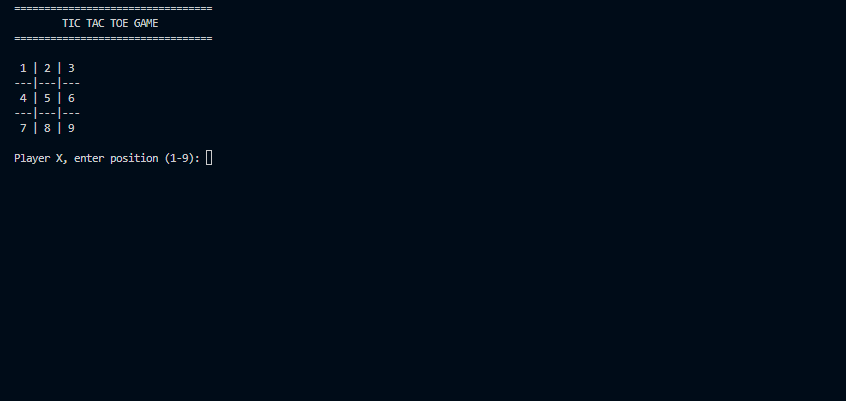
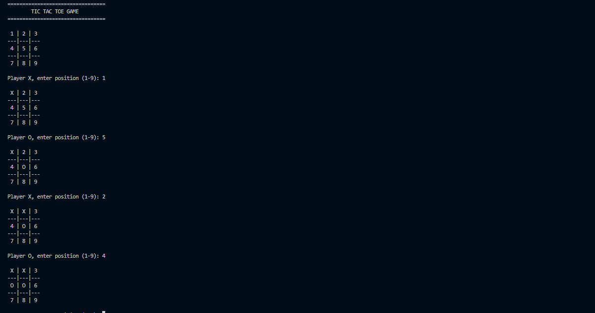
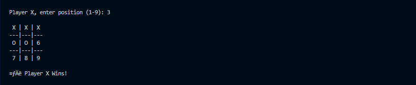

# 🎮 Tic Tac Toe

A console-based **Tic Tac Toe Game** developed in **C++** using arrays, loops, functions, and conditional logic. The game supports two-player gameplay, win detection, draw detection, invalid move handling, and replay functionality.

---


---

# 📌 Project Overview

This project is a console-based implementation of the classic Tic Tac Toe game for two players.

The game dynamically updates the board after every move, validates user input, detects wins and draws, and allows players to replay multiple matches without restarting the application.

This project was developed as part of the **Thiranex C++ Internship Program** to strengthen programming fundamentals including arrays, loops, functions, conditional statements, and game logic.

---

# 📑 Table of Contents

- 📌 Project Overview
- ✨ Features
- 🛠 Technologies Used
- 📂 Project Structure
- 🚀 Getting Started
- 🎮 Gameplay
- 📸 Screenshots
- 📖 Concepts Demonstrated
- 🎯 Future Improvements
- 📚 What I Learned
- 📊 Project Status
- 👨‍💻 Author

---

# ✨ Features

- ✅ Two Player Gameplay
- ✅ Dynamic Game Board
- ✅ Player Turn Switching
- ✅ Win Detection
- ✅ Draw Detection
- ✅ Invalid Move Handling
- ✅ Replay Option
- ✅ Menu-Free Interactive Gameplay

---

# 🛠 Technologies Used

| Technology | Purpose |
|------------|---------|
| C++ | Programming Language |
| Arrays | Game Board |
| Functions | Game Logic |
| Conditional Statements | Win & Draw Detection |
| Loops | Gameplay Control |
| VS Code | Development Environment |
| GCC (MSYS2 MinGW) | Compiler |
| Git & GitHub | Version Control |

---

# 📂 Project Structure

```text
Tic-Tac-Toe/
│
├── screenshots/
│   ├── home.png
│   ├── gameplay.png
│   ├── winner.png
│
├── main.cpp
├── .gitignore
└── README.md
```

---

# 🚀 Getting Started

## Clone Repository

```bash
git clone https://github.com/karrivinay54/Tic-Tac-Toe.git
```

## Navigate

```bash
cd Tic-Tac-Toe
```

## Compile

```bash
g++ main.cpp -o main
```

## Run

### Windows

```bash
./main.exe
```

### Linux / macOS

```bash
./main
```

---

# 🎮 Gameplay

- Player X starts the game.
- Players take turns entering positions from **1–9**.
- The board updates after every valid move.
- Invalid or occupied positions are rejected.
- The game automatically detects:
  - Winner
  - Draw
- Players can choose to play another round without restarting the application.

---

# 📸 Screenshots

## 🏠 Initial Board



---

## 🎮 Gameplay



---

## 🏆 Winning Screen



---

# 📖 Concepts Demonstrated

- Arrays
- Loops
- Functions
- Conditional Statements
- Switch Case
- Input Validation
- Game Logic
- Dynamic Console Output

---

# 🎯 Future Improvements

- Single Player Mode (AI)
- Difficulty Levels
- Scoreboard
- Colored Console Output
- Minimax AI Algorithm
- GUI Version using Qt

---

# 📚 What I Learned

This project helped me gain practical experience with:

- Designing interactive console applications
- Implementing game logic
- Working with multidimensional arrays
- Input validation
- Detecting game outcomes
- Structuring C++ programs using functions
- Managing projects using Git and GitHub

---

# 📊 Project Status

- ✅ Status: Completed
- 🏷 Version: v1.0.0
- 💻 Language: C++
- 🎮 Type: Console Game
- 📅 Last Updated: July 2026

---

# 👨‍💻 Author

**Karri Vinay**

B.Tech – Electronics & Communication Engineering  
RGUKT IIIT Nuzvid

🔗 GitHub: https://github.com/karrivinay54

💼 LinkedIn:  
(https://www.linkedin.com/in/vinay-karri-53071b288/)
---

# ⭐ If you found this project helpful

Consider giving this repository a ⭐ on GitHub.
